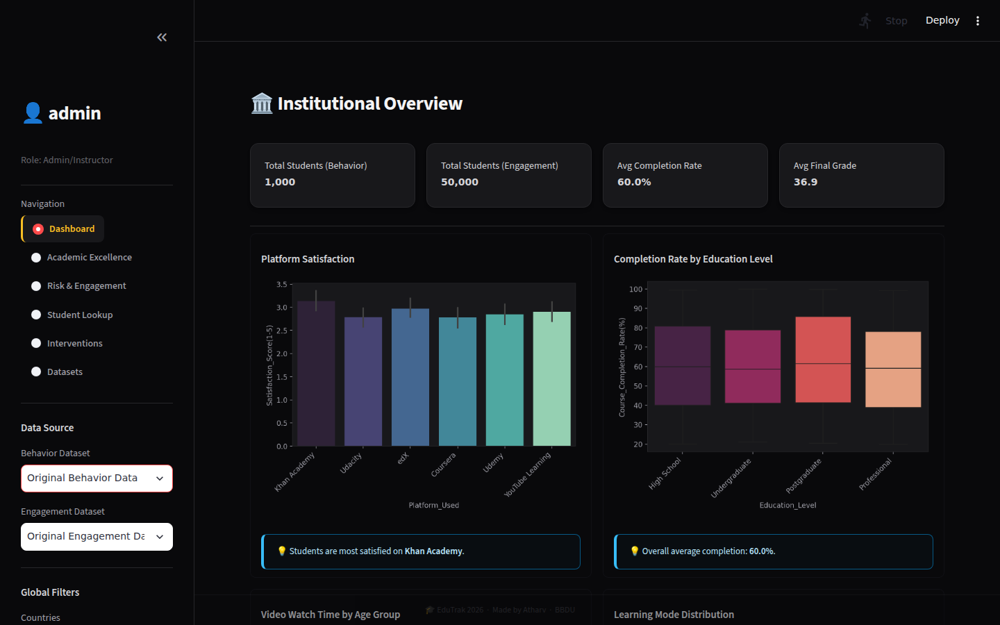
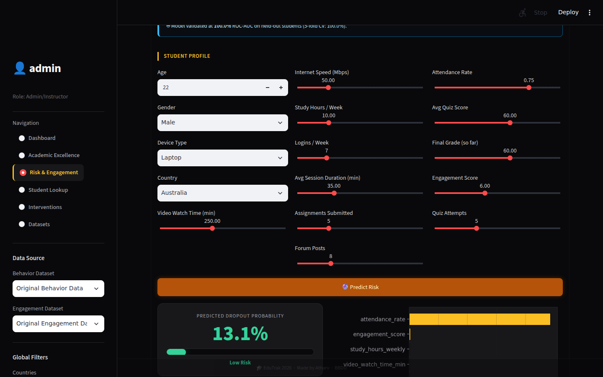
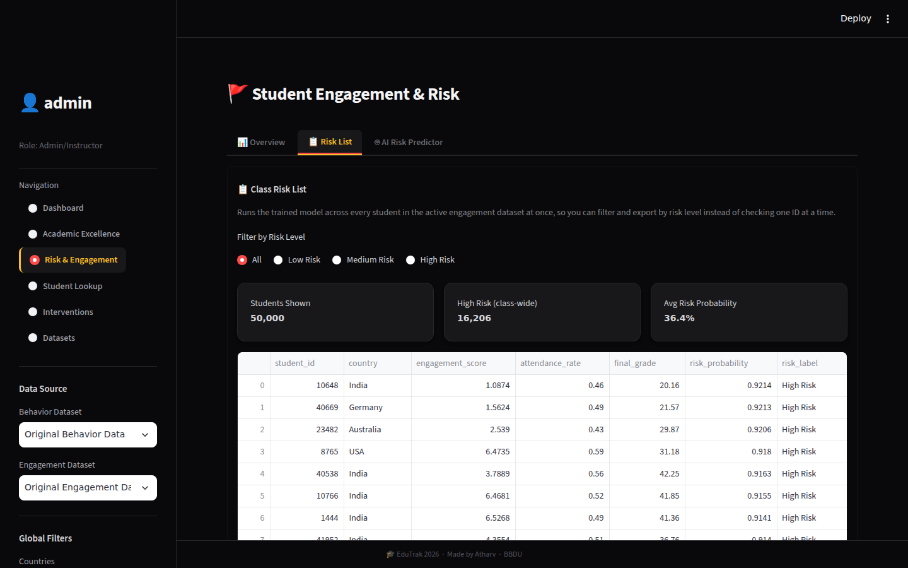
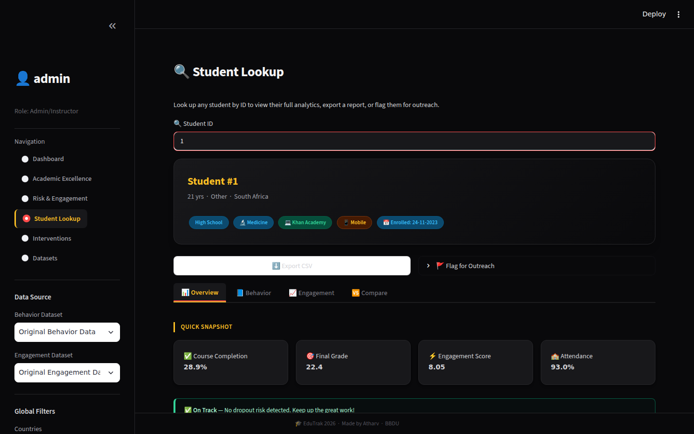
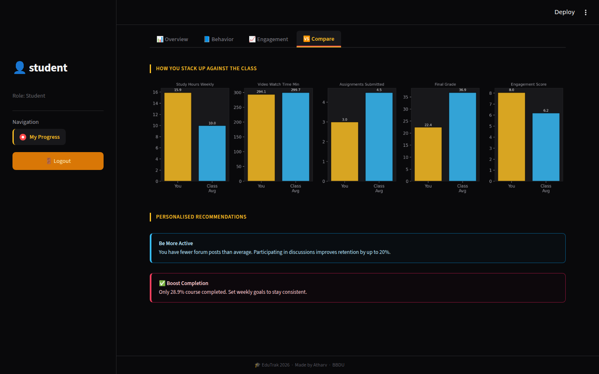
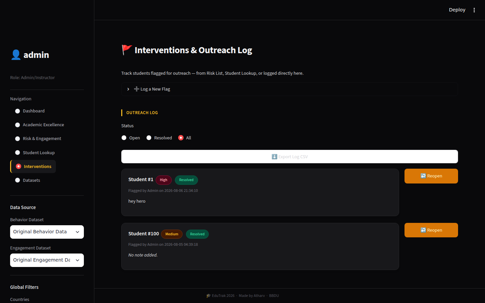

# EduTrak 🎓
### AI-Powered Student Analytics & Early Dropout-Warning Platform


EduTrak is a full-stack educational analytics portal that turns raw student engagement and
behavior data into actionable insight — for institutions and for students themselves. It combines
role-based dashboards, an interactive analytics layer, and a trained machine learning model that
flags at-risk students before they drop out, with a built-in workflow for staff to act on those flags.

Built as a solo capstone project covering the full data lifecycle: schema design → ETL → EDA →
model training/validation → a secure, production-style web application.

---

## 📸 Screenshots

| Admin Dashboard | AI Risk Predictor |
|---|---|
|  |  |

| Class Risk List | Student Lookup |
|---|---|
|  |  |

| Student "You vs Class" Comparison | Interventions Log |
|---|---|
|  |  |

---

## ✨ Features

**Admin / Instructor**
- **Institutional Overview** — platform-wide KPIs: satisfaction, completion rate by education level, video watch time by age group, learning mode distribution
- **Academic Excellence** — correlation matrix + grade relationships (quiz score, attendance, device type) vs. final grade
- **Risk & Engagement** — three-tab view:
  - *Overview* — study hours vs. grade, dropout risk vs. internet speed
  - *Risk List* — every student in the active dataset auto-scored and filterable by risk band, with CSV export
  - *AI Risk Predictor* — enter a student profile and get a live dropout probability + risk label
- **Student Lookup** — pull up any student's full profile on demand
- **Interventions & Outreach Log** — flag a student, log a note/priority, track status (Open/Resolved), export the log to CSV
- **Dataset Management** — upload new behavior/engagement CSVs on the fly; auto-preprocessing (median-fill numeric nulls, "Unknown" for categorical) and dynamic table creation, switchable from the sidebar without redeploying

**Student**
- **My Progress** — personal dashboard with a full profile snapshot, a "You vs. Class Average" side-by-side bar comparison across study hours/grades/engagement, auto-generated personalized recommendations, and a CSV export of their own report

**Platform**
- Role-based auth (Admin/Instructor vs. Student) with sign-up, session state, and logout
- Custom dark "Obsidian & Amber" theme (hand-styled CSS, matched Matplotlib/Seaborn dark palette for chart consistency)

---

## 🧠 Machine Learning — Dropout Risk Model

A `RandomForestClassifier` inside a `sklearn.Pipeline` (`ColumnTransformer` + `OneHotEncoder` for
categoricals) trained on 13 numeric + 3 categorical engagement features, evaluated with a stratified
80/20 split and 5-fold cross-validation (not just a single train/test number).

| Metric | Score |
|---|---|
| Accuracy (held-out test set) | 1.00 |
| ROC-AUC (held-out test set) | 1.00 |
| 5-fold CV ROC-AUC | 1.00 ± 0.00 |

**Why the score is this high — and why that's disclosed, not hidden:** EDA showed `attendance_rate`
alone correlates with dropout at ≈ -0.81 and by itself gets ~99.8% accuracy on this dataset. Dropping
it entirely collapses the other engagement features to ROC-AUC ≈ 0.50 — meaning this particular
synthetic dataset effectively derives `dropout` from attendance and randomizes the rest. Rather than
either hiding this or dropping the feature, the model keeps `attendance_rate` (it's a genuine,
real-time LMS signal in practice) but combines it with the full engagement profile, and is validated
with cross-validation so the reported score isn't a misleadingly-cherry-picked split. This is
intentional: it's evidence of checking for a dominant/leaky feature instead of reporting a headline
number blindly — worth mentioning exactly this way in an interview.

Batch scoring (`predict_dropout_risk_batch`) vectorizes prediction across an entire class for the
Risk List page instead of looping row-by-row.

---

## 🔐 Security

- **SQL-injection guard for dynamic identifiers** — table/column names driven by user-uploaded
  datasets can't be parameterized by SQLite the way values can, so every identifier is checked
  against an allow-list (`sqlite_master` / `PRAGMA table_info`) before being interpolated into a
  query. A name that isn't a real table/column can never pass validation.
- **Password hashing** — PBKDF2-HMAC-SHA256 with a random per-user salt (100,000 iterations,
  stdlib-only via `hashlib` + `secrets`). Legacy plaintext rows (e.g. the seeded `admin`/`student`
  accounts) are verified once and transparently rehashed on next login, so no separate migration
  script is needed.

---

## ✅ Tested End-to-End

Every claim in this README is backed by an actual run of the app, not just a read of the code:
- Full login → all 6 admin pages → student view walked through on a live local instance
- The ML metrics above were pulled directly from the trained `dropout_model.pkl`, not estimated
- The security fixes were verified against the database directly: SQL-injection allow-list blocks
  malicious table names, and stored passwords are confirmed hashed (PBKDF2, not plaintext)
- Every screenshot in this README is a real capture from the running app — Institutional Overview,
  the Risk List scoring all 50,000 engagement records, the AI Risk Predictor returning a live result,
  Student Lookup, the student-side Compare view, and the Interventions log

---

## 🛠️ Tech Stack

| Layer | Technology |
|---|---|
| UI / Frontend | Streamlit |
| Backend Logic | Python |
| Database | SQLite3 |
| Data Wrangling | Pandas, NumPy |
| Machine Learning | scikit-learn (RandomForestClassifier, Pipeline, ColumnTransformer), joblib |
| Visualization | Matplotlib, Seaborn |

---

## 🗂️ Project Structure

```
EduTrak/
├── app.py                   # Main Streamlit app — UI, routing, auth, all dashboard pages
├── analytics.py              # DB access, analytics/stats functions, ML inference, security helpers
├── database_setup.py         # One-time DB init: creates tables, loads source CSVs, seeds users
├── train_dropout_model.py    # Trains & evaluates the RandomForest dropout model → dropout_model.pkl
├── dropout_model.pkl         # Trained model bundle (model + feature lists + metrics)
├── requirements.txt
├── .gitignore
└── README.md
```

> `edutrak.db` is intentionally git-ignored — it's generated locally by `database_setup.py` and
> contains your own seeded accounts/data, not something to commit.

---

## 📊 Datasets

| Dataset | Records | Description |
|---|---|---|
| Behavior (`Online_Learning_Behavior_Dataset_Worldwide.csv`) | 1,000 | Platform used, satisfaction, course completion rate, learning mode |
| Engagement (`online_learning_engagement_dataset.csv`) | 50,000 | Study hours, quiz scores, attendance, engagement score, final grade, dropout flag |

---

## ⚙️ Setup & Installation

**1. Clone the repo**
```bash
git clone https://github.com/<your-username>/EduTrak.git
cd EduTrak
```

**2. Create a virtual environment (recommended)**
```bash
python -m venv venv
venv\Scripts\activate        # Windows
source venv/bin/activate     # macOS/Linux
```

**3. Install dependencies**
```bash
pip install -r requirements.txt
```

**4. Add the source datasets**
Place `Online_Learning_Behavior_Dataset_Worldwide.csv` and `online_learning_engagement_dataset.csv`
in the project root.

**5. Initialize the database**
```bash
python database_setup.py
```
Creates `edutrak.db`, loads both datasets, and seeds default accounts.

**6. Train the dropout risk model**
```bash
python train_dropout_model.py
```
Prints accuracy/ROC-AUC/cross-validation metrics and saves `dropout_model.pkl`. Only needs to be
re-run if the engagement data changes.

**7. Run the app**
```bash
streamlit run app.py
```

---

## 🔑 Default Credentials

| Role | Username | Password |
|---|---|---|
| Admin/Instructor | `admin` | `admin` |
| Student | `student` | `student` |

New accounts can also be created via the Sign Up option in the sidebar.

---

## 🗺️ Roadmap

- [ ] Deploy to Streamlit Community Cloud with a live demo link
- [ ] Migrate from SQLite to PostgreSQL for multi-user production use
- [ ] Scheduled/automated model retraining as new engagement data comes in
- [ ] Email/SMS alerts for newly flagged high-risk students

---

## 👤 Author

**Atharva Maurya**
Final-year BCA (Data Science & AI) student, BBDU
Built as a portfolio project for Data Analyst roles.

## 📄 License

This project is licensed under the MIT License.
